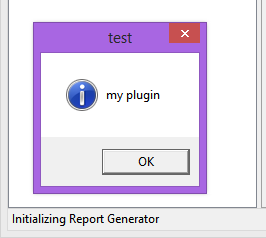
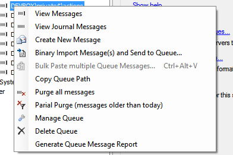
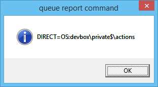
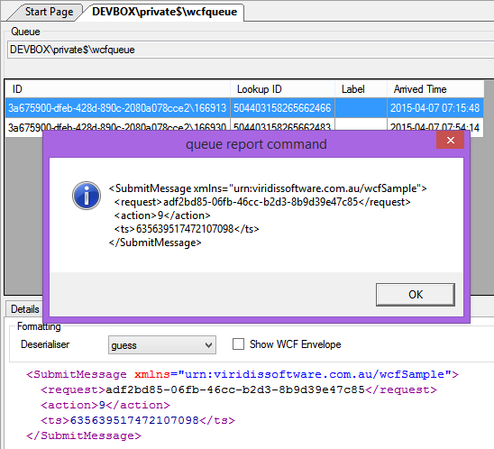

# Creating the Plug In

This is the documentation of step by step how to create a plug in for MSMQ Inspector that will iterate a queue and produce a report of all the messages in it. 

This scenario is probably most likely to come up in an error queue where you simply want to see all the data, then you can perform diagnosis etc.

I will do this in VS.NET.

## Create a New Project

New Project - target **.NET Framework 4**

Windows Desktop - Class Library

I am calling it `MSMQ.ReportGenerator.PlugIn`

We need to make sure we are creating a 32 bit application:

* Open the **Project Properties**
* Select "All Configurations" as this applies to debug and release builds
* Change the **Platform Target** to **x86**

## Essential References

Next we will need to reference at least the following to get anywhere:

* System.Messaging
* ViridisSoftware.MsmqInspector.GUI.Core - I browse straight to "C:\Program Files (x86)\MSMQ Inspector\ViridisSoftware.MsmqInspector.GUI.Core.dll"

## Pre-Build Event

Next we can add a "pre-build" event to copy the MSMQ Inspector files to the current build folder.
The reason for this is so that you can simply go to you `bin\Degug` folder and run the application and it will look locally for your DLL. 

If I build the project now I get output similar to:

	1>------ Build started: Project: MSMQ.ReportGenerator.PlugIn, Configuration: Debug Any CPU ------
	1>  C:\Program Files (x86)\MSMQ Inspector\App.ico
	1>  C:\Program Files (x86)\MSMQ Inspector\ChangeLog.txt
	1>  C:\Program Files (x86)\MSMQ Inspector\License-Icons.txt
	1>  C:\Program Files (x86)\MSMQ Inspector\License-ICSharpCode.TextEditor.txt
	1>  C:\Program Files (x86)\MSMQ Inspector\License-MSMQInspector.txt
	1>  C:\Program Files (x86)\MSMQ Inspector\License-WeifenLuo.WinFormsUI.Docking.txt
	1>  C:\Program Files (x86)\MSMQ Inspector\MSMQInspector.exe
	1>  C:\Program Files (x86)\MSMQ Inspector\MSMQInspector.exe.config
	1>  C:\Program Files (x86)\MSMQ Inspector\ReadMe.htm
	1>  C:\Program Files (x86)\MSMQ Inspector\unins000.dat
	1>  C:\Program Files (x86)\MSMQ Inspector\unins000.exe
	1>  C:\Program Files (x86)\MSMQ Inspector\ViridisSoftware.MsmqInspector.GUI.Core.dll
	1>         12 file(s) copied.
	1>  MSMQ.ReportGenerator.PlugIn -> msmq-inspector-contrib\src\MSMQ.ReportGenerator.PlugIn\bin\Debug\MSMQ.ReportGenerator.PlugIn.dll
	========== Build: 1 succeeded, 0 failed, 0 up-to-date, 0 skipped ==========

## Creating the Plug In Loader

The application will look for DLL's that contain "loaders". 
These are classes that implement `MsmqInspector.GUI.Core.IPlugIn` interface and this is where you hook into the system and add menu items, register commands etc.

The interface looks like this but there is a base class (`PluginLoaderBase`) for the boiler plate code:

	namespace MsmqInspector.GUI.Core
	{
	  public interface IPlugIn
	  {
	    string PluginDescription { get; }
	
	    string PluginName { get; }
	
	    int RequestedLoadOrder { get; }
	
	    void InitializePlugIn();
	
	    void LoadPlugIn(IApplicationServices services);
	
	    void UnloadPlugIn();
	  }
	}

All fairly standard information.

A bare bones loader could look like this:

	using System;
	using MsmqInspector.GUI.Core;
	
	namespace MSMQ.ReportGenerator.PlugIn
	{
	    public class ReportGeneratorLoader : PluginLoaderBase, IPlugIn
	    {
	        public ReportGeneratorLoader() : 
	            base("Report Generator", "Generates a report of the contents of all the messages in a queue", 1000)
	        {
	        }
	
	        public override void InitializePlugIn()
	        {
	        }
	    }
	}

When the application loads a plug in, a call to `LoadPlugIn(IApplicationServices services)` is made and the services are passed in. 
The `IApplicationServices` interface is an application shell related item. 
It has pointers to other core parts of the application such as the "Host Window" (`IHostWindow`).
When setting up a plug in most of the interactions will be with either the ***application services*** to register commands and services, or with the ***host window*** to add menu items for example.

To check that the plug in loader is working as expected lets add a call to `IHostWindow.DisplayMessageBox`.
This is a wrapper call to MessageBox.Show so nothing too exciting but will show us that things are working.

Modify the `InitializePlugIn` method and build:

    public override void InitializePlugIn()
    {
        Services.HostWindow.DisplayMessageBox(
            null /* not relevant */, 
            "my plugin" /* message text */, 
            "test" /* caption */, 
            MessageBoxButtons.OK,
            MessageBoxIcon.Information, 
            MessageBoxDefaultButton.Button1,
            MessageBoxOptions.DefaultDesktopOnly, 
            null, 
            null);
    }

To run the application go to the build folder, e.g. "src\MSMQ.ReportGenerator.PlugIn\bin\Debug" and if the pre-build events are set-up you should have a copy of *MSMQ Inspector* in the folder. 
Simply run the application and you should see the message bos show up.

If you can't see the message box make sure that you are running the Premium edition of the software (required to run external plug-ins) and that the Option for "loadExternalPlugins" is set to true.

Get rid of that code for now, lets add something interesting.

## Adding a Command

Next we will create a command to start the report and then we will flesh it out with the code to create a report.
We need to:

* Get the current Server information
* Get the current Queue information
* Get (peek) the messages on the queue

Once we have this information we can render some sort of report.

To give you an idea of what a command looks like, lets take a look at a simple one, here is a trimmed version of the command that :

	// cut down version of the "Copy Queue Path" command	
    public class QueueInspector : AppCommandBase
    {
        public CopyQueuePathCommand()
            : base("Copy Queue Path")
        {
        }

        public override void Execute()
        {
            Clipboard.SetText(HostWindow.QueueInspector.RightClickedQueueName);
        }
    }

Not too much rocket science going on in there, you can probably guess what is going on without a word from me. The `QueueInspector` is a code based reference via the shell to the "Queue Inspector" you see in the application.

How is this wired up?
Inside the `loader.InitializePlugIn()` method for this plug-in there is some code to add a menu item to the context menu for the queue inspector (yes, the application uses the same system to load its internal workings).

	...
	Services.HostWindow.QueueInspector.QueueMenu.Items.Add(
		CommandControlBuilder.CreateToolStripMenuItem<CopyQueuePathCommand>());
	...

This displays a menu item that when clicked, executes the code above.

Lets make use of this as a bit of a template for the report generator. Create a class called `GenerateQueueMessageReportCommand` and inherite from `AppCommandBase` (it just covers the basic command information). 

I am going to display the "FormatName" of the queue that is selected in the "Queue Inspector". 
Normally it is best to check that this is not null etc but I am keeping the code simple for now. 

The snippet `HostWindow.QueueInspector.MessageQueueContext.FormatName` will get the "Format Name" of the queue (e.g. "DIRECT=OS:devbox\private$\actions"). 
I find this the most reliable way of getting a queue connection.

    public class GenerateQueueMessageReportCommand : AppCommandBase
    {
        public GenerateQueueMessageReportCommand()
            : base("Generate Queue Message Report")
        {
        }

        public override void Execute()
        {
            var formatName = HostWindow.QueueInspector.MessageQueueContext.FormatName;

            Services.HostWindow.DisplayMessageBox(
                null /* not relevant */,
                formatName /* message text */,
                "queue report command" /* caption */,
                MessageBoxButtons.OK,
                MessageBoxIcon.Information,
                MessageBoxDefaultButton.Button1,
                MessageBoxOptions.DefaultDesktopOnly,
                null,
                null);
        }
    }

> Note that I had to add a reference to **System.Drawing** for this to build.

Next, we need to wire up the command to a button or menu item somewhere. 
Let's put it on the command on the Queue Context Menu (Services.HostWindow.QueueInspector.QueueMenu). 
We simply access the Items directly and add a tool strip item - use the helper `CommandControlBuilder.CreateToolStripMenuItem<T>` as it wires things up for you).

The `InitializePlugIn` method looks like this:

    public override void InitializePlugIn()
    {
        Services.HostWindow.QueueInspector.QueueMenu.Items.Add(
            CommandControlBuilder.CreateToolStripMenuItem<GenerateQueueMessageReportCommand>());
    }

Next build the plug-in and run the executable (MSMQInspector.exe).
Expand a server node and right click on a queue - in my case it is "audit" - you will see the new menu option: 

Execute the command by clicking on it, you will see the message box show up with the server name and queue name as expected: 

Now we have a custom command integrated into *MSMQ Inspector* and the context menu by queue name. 
Next we will need to flesh out the report side of it - we will need to access the messages on the queue.

## Accessing Message Data

This is still pretty basic stuff but we have been accessing the queue information with wrappers that simplify the task.
Next is another helpful command that does most of the work for us: `MsmqListCommand`.
Here is an example of how to use it:

    public override void Execute()
    {
        // Get the "Format Name":
        var formatName = HostWindow.QueueInspector.MessageQueueContext.FormatName;

        // Get an instance of "IMsmqQueueManager" for better access to the queues:
        var msmqQueueManager = Services.Resolve<IMsmqQueueManager>();

        // Set the path to the format name of the selected queue:
        msmqQueueManager.QueuePath = formatName;

        // Create an MSMQ List Command - a wrapper that peaks the message data on the queue:
        var listCommand = new MsmqListCommand();

        // By default the body of the message is not loaded, set "DisplayBody" to true and 
        // this will be retrieved with the message:
        listCommand.DisplayBody = true;

        // Execute the list command, this *will* enumerate the messages in the queue:
        listCommand.Execute(msmqQueueManager);

        // For now lets just report the Count:
        Services.HostWindow.DisplayMessageBox(
            null /* not relevant */,
            listCommand.Result.Count.ToString() /* message text */,
            "queue report command" /* caption */,
            MessageBoxButtons.OK,
            MessageBoxIcon.Information,
            MessageBoxDefaultButton.Button1,
            MessageBoxOptions.DefaultDesktopOnly,
            null,
            null);
    }

Lets walk though this:

* Get the "Format Name" as before using `HostWindow.QueueInspector.MessageQueueContext.FormatName`

* Get an instance of `IMsmqQueueManager` for better access to the queues - this is basically a helper that manages a connection to an MSMQ

* Set the path to the format name of the selected queue

* Create an MSMQ List Command - this again is a wrapper that "peaks" the message data on the queue we specify

* Next we set the list commands "DisplayBody" property to true to get the contents of the messages - by default the body of the message is not loaded to keep the command execution fast

* Execute the list command and yes, this *will* enumerate the messages in the queue

For now I am just displaying the `Count` of the list command.
Lets build and run to make sure all is well.
Now if you run the report command you will see a message box with the total.

Next, lets get some message data.

> I am assuming you have at least one message in the queue here, if not create one using the "Create New Message" command - even a simple JSON payload will do, e.g. `{ test: true }`

Make the following modification:

    // Grab the first message - render the contents
    var message = listCommand.Result.First();
    message.Formatter = new TextMessageFormatter();
    var msg = message.Body.ToString();

    // For now lets just report the Count:
    Services.HostWindow.DisplayMessageBox(
        null /* not relevant */,
        msg /* message text */,
        "queue report command" /* caption */,
        MessageBoxButtons.OK,
        MessageBoxIcon.Information,
        MessageBoxDefaultButton.Button1,
        MessageBoxOptions.DefaultDesktopOnly,
        null,
        null);

This is about getting the first message in the result and rendering it using the built in "Text Message Foramtter".
If your message has a simple ASCII/JSON/XML in the body you will probably see a decent view of it.

Lets make this a bit smarter. 

MSMQ Inspector has a concept of a "prefered deserialiser" - you can access this setting for the current queue with this code: `Services.HostWindow.QueueInspector.GetPreferredDeserialiserForQueue(name)` - for example:

    // Use the "Name" of the queue to lookup the preferred deserialiser (if any), the default
    // is "guess" (note that the format of the key used to lookup the Preferred Deserialiser
    // is "<machine>\<queue-name>", e.g. "server\private$\orders".
    var preferredDeserialiser = Services.HostWindow.QueueInspector.GetPreferredDeserialiserForQueue(
        HostWindow.QueueInspector.MessageQueueContext.Name);

So what we get here is "xml", or "wcf" or at least "guess".
This value can then be used to pass to `IMessageBodyRenderService.Render(byte[] bytes, string deserialiser, Dictionary<string, string> deserialiserValues)` - this will take care of transforming the `bytes` we pass in according to the `deserialiser` we specify. 
The last parameter is about passing around extra settings in a generic manner, we can use null here.

How does this all look?

    // Use the "Name" of the queue to lookup the preferred deserialiser (if any), the default
    // is "guess" (note that the format of the key used to lookup the Preferred Deserialiser
    // is "<machine>\<queue-name>", e.g. "server\private$\orders".
    var preferredDeserialiser = Services.HostWindow.QueueInspector.GetPreferredDeserialiserForQueue(
        HostWindow.QueueInspector.MessageQueueContext.Name);

    // Grab the first message - render the contents
    var message = listCommand.Result.First();

    // Get an instance of the rendering service:
    var messageBodyRenderService = Services.Resolve<IMessageBodyRenderService>();

    // We need the message data in byte format, convert the stream to bytes:
    byte[] bytes;
    using (var sr = new StreamReader(message.BodyStream, true))
    {
        var length = (int)sr.BaseStream.Length;
        bytes = new byte[length];
        sr.BaseStream.Read(bytes, 0, length);
    }
	
	// Use the Render Service to change the message bytes into a string:
    var msg = messageBodyRenderService.Render(bytes, preferredDeserialiser, null);

    // For now lets just report the Count:
    Services.HostWindow.DisplayMessageBox(
        null /* not relevant */,
        msg /* message text */,
        "queue report command" /* caption */,
        MessageBoxButtons.OK,
        MessageBoxIcon.Information,
        MessageBoxDefaultButton.Button1,
        MessageBoxOptions.DefaultDesktopOnly,
        null,
        null);

Here is an example where using a Queue that has WCF messages on it:

One thing to note is that the redering service will also take notice of the "Show WCF Envelope" setting.
If you have a WCF message try executing the report with the setting on and off.

From here we are only a few lines of code away from rendering every message in the queue.

 